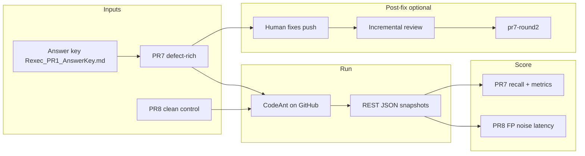

# CodeAnt on Rexec — benchmark summary

**Repository:** [vickky06/codeant-benchmark](https://github.com/vickky06/codeant-benchmark)  
**Application:** [vickky06/Rexec](https://github.com/vickky06/Rexec)  
**Status:** Draft / living (merge findings branch to `main` when ready)  
**Last aligned to docs:** `PR1_CodeAnt_Score.md`, `PR2_CodeAnt_Score.md`, `fix_loop_results.md`, `pr7-round2/`, `pr8/`, `Plan.MD` (2026-05-13 benchmark run)

This page is the **single entry summary**. Every quantitative claim below is backed by the linked files.

---

## Executive summary

- **What we tested:** [CodeAnt AI](https://codeant.ai) on **two** controlled GitHub PRs in a Rust repo: a **defect-rich** PR with a written answer key, and a **clean-control** PR with no seeded defects.
- **PR #7 (defect-rich):** **85%** weighted recall (**17 / 20**); **D4 missed** (silent session overwrite / guard removal); **0** inline false positives; **0** noise; **80%** file coverage (4 / 5); **~9.2 min** cold review latency; PR-level **CodeAnt-AI Description** scored **1 / 5** (misaligned with inline severity — see full report).
- **PR #8 (clean control):** **0** false positives; **0** noise; **50%** inline file coverage (2 / 4); **~4 min 13 s** warm latency; summary quality **4 / 5** — good control arm vs PR #7.
- **Round 2 (incremental, after fixes on PR #7):** Issue comments show incremental review **~66 s**; GitHub REST export in `pr7-round2/` shows **no new** `pulls/7/reviews` rows and **no new** inline threads on post-fix head — interpret cautiously (see [Round 2](#round-2-incremental-pr-7)).
- **Extra signal:** CodeAnt flagged blocking `curl` in async `cleanup_ports` beyond the six-defect answer key (credit in `PR1_CodeAnt_Score.md`).
- **Merge gating:** Reviews remain **`COMMENTED`** with empty body in exports — **branch-protection “required review”** equivalence **not verified** here; confirm **Checks** on each PR.
- **Validity (one line):** Strong **controlled feasibility** signal for one vendor + one codebase; **not** a statistical proof of correctness across all repos or agents.
- **Open housekeeping:** Merge findings branch to `main`; rotate benchmark PAT when done; optional **UI-per-thread “Fix in Cursor”** timing if you want that dimension measured explicitly (`Plan.MD`).

---

## Scope and PRs

| PR | Role | Link |
|----|------|------|
| **#7** | Defect-rich benchmark; six weighted defects (answer key) | https://github.com/vickky06/Rexec/pull/7 |
| **#8** | Clean control (max code length); FP / noise / latency | https://github.com/vickky06/Rexec/pull/8 |

**Answer key:** `Rexec_PR1_AnswerKey.md`  
**Plan / checklist:** `Plan.MD`  
**Round 2 runbook:** `docs/PR7-ROUND2-EXECUTION-LOG.md`  
**PR #8 thread inventory:** `docs/PR8-comments-inventory.md`

---

## Results (numbers)

### PR #7 — defect-rich (round 1 scoring)

Source: **`PR1_CodeAnt_Score.md`**, artifacts **`pr1_*.json`**.

| Metric | Value |
|--------|--------|
| Weighted recall | **85%** (17 / 20) |
| Missed (answer key) | **D4** — no comment on `session_management_service.rs` / silent overwrite |
| False positives (inline) | **0** |
| Noise | **0** |
| Inline file coverage | **80%** (4 / 5 files) |
| Cold latency (open → “finished reviewing”) | **~9.2 min** |
| Summary quality (PR body block) | **1 / 5** |
| Review verdict (API) | `COMMENTED`, empty review `body` |

### PR #8 — clean control

Source: **`PR2_CodeAnt_Score.md`**, **`pr8/*.json`**, **`docs/PR8-comments-inventory.md`**.

| Metric | Value |
|--------|--------|
| False positives (inline) | **0** |
| Noise | **0** |
| Inline threads (CodeAnt) | **2** (config rollout + hot-path config fetch) |
| Inline file coverage | **50%** (2 / 4 files changed) |
| Warm latency (open → “finished reviewing”) | **~4 min 13 s** |
| Summary quality | **4 / 5** |
| Review verdict (API) | `COMMENTED`, empty review `body` |

### Round 2 (incremental, PR #7)

Source: **`fix_loop_results.md`**, **`PR1_CodeAnt_Score.md`** addendum, **`pr7-round2/*.json`**.

| Item | Value |
|------|--------|
| PR head (snapshot) | `d7cb552b9e7d1ff72235c2b01379f2b0060d72ea` |
| Incremental (issue comments) | Start `2026-05-13T10:31:23Z` → complete `2026-05-13T10:32:29Z` (**~66 s**) |
| `pulls/7/reviews` (CodeAnt, in export) | **2** reviews, both on round-1 commit `5561aa5…` — **none** on `d7cb552…` |
| `pulls/7/comments` (CodeAnt, in export) | **7** inline threads, all `commit_id` = `5561aa5…` — **none** on `d7cb552…` |

**Interpretation:** Incremental completion is real on the **conversation timeline**; this REST snapshot does **not** prove “no analysis” on the new SHA — it proves **no new review/inline objects** in the captured JSON. Do not use this alone as a merge gate.

---

## Answer key vs CodeAnt (PR #7)

| ID | Dimension | Weight | Verdict | Evidence pointer |
|----|-----------|--------|---------|-------------------|
| D1 | Security | 5 | CAUGHT | `PR1_CodeAnt_Score.md` table |
| D2 | Observability | 3 | CAUGHT | ibid. |
| D3 | Compatibility | 5 | CAUGHT | ibid. |
| D4 | Resource | 3 | **MISSED** | ibid. |
| D5 | Correctness | 2 | CAUGHT | ibid. |
| D6 | Failure-handling | 2 | CAUGHT | ibid. |

---

## Methodology (short)

1. **Design** two PRs: seeded defects + clean control; pre-write **answer key** for PR #7.  
2. **Run** CodeAnt on GitHub; capture **REST JSON** (`fetch_rexec_pr.sh`) into this repo.  
3. **Score** recall (PR #7), FP/noise/latency/summary (PR #8), and narrative risks (summary vs inline).  
4. **Fix** (optional): human fixes on PR #7; capture **incremental** outcome + second snapshot `pr7-round2/`.  
5. **Document** limitations and merge-gating reality separately from “recall score.”



---

## Validity: what we can and cannot claim

**Can support**

- On **this** Rust PR, with **these** seeded defects, CodeAnt achieved **high weighted recall** with **zero** inline FPs/noise on scored threads.
- Clean control shows **low noise** and **faster warm** review vs cold defect-rich run.
- **Summary layer** can diverge badly from inline on a misleading author narrative (PR #7).

**Cannot support**

- Universal “CodeAnt is valid for all languages/repos.”
- “Never misses D4-like bugs” — we have an **existence proof of one miss**.
- “Incremental review = no work” if REST shows no new threads — **API visibility** and product behavior may differ; verify Checks / UI.

---

## Recommendations

| Action | Owner | Status |
|--------|--------|--------|
| Merge findings branch → `main` | You | See `Plan.MD` |
| Confirm CodeAnt **Checks** vs comments-only for branch protection | You | Not captured in JSON |
| Bitbucket pilot (same two-PR idea) | Org | Planned |
| Optional second vendor (e.g. CodeRabbit) same protocol | Org | Optional |
| Revoke benchmark PAT when study closed | You | Good practice |
| Optional: log **Fix in Cursor** per-thread time | You | `Plan.MD` remaining |

---

## Reproduce

From repo root ([codeant-benchmark](https://github.com/vickky06/codeant-benchmark)):

```bash
export GH_TOKEN='…'   # never commit
./fetch_rexec_pr.sh 7 pr7-round2   # optional second folder
./fetch_rexec_pr.sh 8              # writes pr8/
```

Full checklist: `docs/PR7-ROUND2-EXECUTION-LOG.md` · Overall plan: `Plan.MD` · Ops notes: `docs/NEXT-STEPS.md`.

---

## Artifact index

| Path | Contents |
|------|----------|
| `pr1_meta.json` … `pr1_issue_comments.json` | PR #7 round 1 |
| `pr7-round2/*.json` | PR #7 snapshot after fixes + incremental |
| `pr8/*.json` | PR #8 |
| `PR1_CodeAnt_Score.md` | Full PR #7 analysis + round 2 addendum |
| `PR2_CodeAnt_Score.md` | Full PR #8 analysis |
| `fix_loop_results.md` | Fix rehearsal + round 2 notes |
| `Plan.MD` | Completed vs remaining |
| `docs/PR8-comments-inventory.md` | PR #8 threads |
| `docs/PR7-ROUND2-EXECUTION-LOG.md` | Round 2 runbook |
| `fetch_rexec_pr.sh` | Fetch helper |

---

## Related docs

- `README.md` — entry tables  
- `docs/PR2-clean-control-spec.md` — PR #8 design intent  
- `docs/NEXT-STEPS.md` — merge gating, Bitbucket, optional vendor  

When this file and `main` disagree, prefer **`main`** after merge, or the branch named in `Plan.MD` until merge completes.
