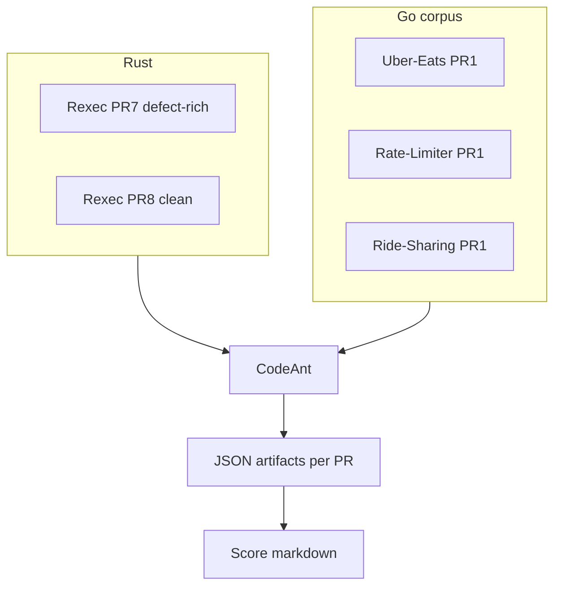

# CodeAnt benchmarks — summary (Rexec + Go corpus)

**Repository:** [vickky06/codeant-benchmark](https://github.com/vickky06/codeant-benchmark)  
**Canonical branch:** `main` (merged benchmark work)  
**Last aligned to:** `PR1_CodeAnt_Score.md`, `PR2_CodeAnt_Score.md`, `UberEats_PR_Score.md`, `RateLimiter_PR_Score.md`, `RideSharing_PR_Score.md`, `docs/Go-Corpus-Design.md`, `fix_loop_results*.md`  
**Arithmetic + JSON audit:** **`docs/CALCULATION-VERIFICATION.md`**

This page is the **single entry summary** for leadership and Confluence handoff. Detailed evidence lives in the linked score files and `*/pr_*.json` folders.

---

## Executive summary

- **Rust (Rexec):** PR [#7](https://github.com/vickky06/Rexec/pull/7) defect-rich — **85%** weighted recall (**17 / 20**), **D4** silent-overwrite missed; PR [#8](https://github.com/vickky06/Rexec/pull/8) clean control — **0** FP, **~4 min 13 s** warm. PR #7 summary quality **1 / 5** vs strong inline (see `PR1_CodeAnt_Score.md`).
- **Go — Uber-Eats PR #1:** **40%** weighted recall (**8 / 20** weighted; **2 of 6 defects** caught — U1 secret + U2 PII log); **U3, U4, U5, U6 missed** (U4 silent overwrite = **same class as Rexec D4**). **0** inline FP (round 1). Summary quality **1 / 5**. Cold **~6 min**. Source: `UberEats_PR_Score.md`, `uber-eats-pr1/`.
- **Go — Rate-Limiter PR #1:** **75%** recall (**15 / 20**); **RL3** wire-breaking rename missed. **0** inline FP. Summary **1 / 5**. Warm **~4 min 35 s**. Source: `RateLimiter_PR_Score.md`, `rate-limiter-pr1/`.
- **Go — Ride-Sharing PR #1:** **100%** recall (**20 / 20**) on four seeded concurrency defects; **0** FP round 1; summary **1 / 5** (✅ vs Critical inline — systematic). Cold **~4 min 17 s**. **Round 2:** incremental **~5 min 37 s**; **3 false positives** on post-fix `GetAllStates` (see `RideSharing_PR_Score.md` § Round 2). Artifacts: `ride-sharing-pr1/`, `ride-sharing-pr1-round2/`.
- **Cross-language:** Concurrency class **strong** on Ride-Sharing + RL4; **silent overwrite blind spot** reproduced (**D4 + U4**). Wire/API renames weak (**D3 pattern vs RL3**). See class table in `RideSharing_PR_Score.md` § “Cross-language updated picture”.
- **Fix-me (Go):** All CodeAnt round-1 caught items addressed in fix commits (**8 / 8** Uber-Eats + Rate-Limiter; **12 / 12** incl. Ride-Sharing) — `fix_loop_results_go_addendum.md`. **Note:** fixes were not via CodeAnt “Fix in Cursor” UI (methodology gap documented there).
- **Merge gating:** Reviews remain **`COMMENTED`** / empty body in exports — **required-check equivalence not proven**; confirm Checks per PR.
- **NetApp / manual gate:** See **`NETAPP_RECOMMENDATION.md`** and `docs/Go-Corpus-Design.md`.

---

## Results table (headline)

> **Reading convention:** `X / 20` is **weighted points** (not defect count). Each defect-rich PR seeds 4–6 defects whose severity weights sum to 20. The `caught / total` column below resolves any ambiguity.

| Track | PR | Language | Defects caught / total | Weighted recall | FP (inline R1) | Summary 1–5 | Latency (typical) |
|-------|-----|----------|-------------------------|-------------------|----------------|-------------|-------------------|
| Rexec PR #7 | [link](https://github.com/vickky06/Rexec/pull/7) | Rust | **5 / 6** (missed D4) | **85%** (17/20) | 0 | 1 | ~9.2 min cold |
| Rexec PR #8 | [link](https://github.com/vickky06/Rexec/pull/8) | Rust | clean control | N/A (clean) | 0 | 4 | ~4.2 min warm |
| Uber-Eats PR #1 | [link](https://github.com/vickky06/Uber-Eats/pull/1) | Go | **2 / 6** (missed U3, U4, U5, U6) | **40%** (8/20) | 0 | 1 | ~6 min cold |
| Rate-Limiter PR #1 | [link](https://github.com/vickky06/Rate-Limiter/pull/1) | Go | **5 / 6** (missed RL3) | **75%** (15/20) | 0 | 1 | ~4.6 min warm |
| Ride-Sharing PR #1 | [link](https://github.com/vickky06/Ride-Sharing-Trip-Manager/pull/1) | Go | **4 / 4** | **100%** (20/20) | 0 R1; **3 FP R2** on fix head | 1 | ~4.3 min cold; ~5.6 min incremental |

---

## Scope & design

- **Rust arm:** Rexec PR #7 / #8 — answer key `Rexec_PR1_AnswerKey.md`.  
- **Go corpus:** dual-arm rationale + third high-signal PR — **`docs/Go-Corpus-Design.md`**.  
- **Round 2:** Rexec `pr7-round2/`; Ride-Sharing `ride-sharing-pr1-round2/`; Uber-Eats `uber-eats-pr1-round2/` where present.

---

## Methodology (short)

1. Seeded defect PRs + written answer keys (same D1–D6-style taxonomy where applicable).  
2. CodeAnt on GitHub → capture REST JSON (`fetch_rexec_pr.sh`, **`fetch_pr.sh`**).  
3. Human scoring in `*_PR_Score.md`.  
4. Optional fix commits + incremental re-review → document API vs issue-comment behavior.



---

## Validity (what we can claim)

**Can:** Directional recall on **these** PRs; **0** round-1 inline FP on scored threads for listed repos; **cross-language** silent-overwrite miss pattern (D4 + U4); Ride-Sharing **round-2 FP regression** as a **gate-risk** signal.  
**Cannot:** Statistical generalization to all Go/Rust codebases; “CodeAnt always …”; **Fix in Cursor** UX cost (not measured — see `fix_loop_results_go_addendum.md`).

---

## Reproduce

```bash
# Rexec (uses GH_TOKEN + curl)
export GH_TOKEN='…'
./fetch_rexec_pr.sh 7
./fetch_rexec_pr.sh 8

# Any repo (uses gh CLI)
./fetch_pr.sh vickky06/Uber-Eats 1 uber-eats-pr1
./fetch_pr.sh vickky06/Rate-Limiter 1 rate-limiter-pr1
./fetch_pr.sh vickky06/Ride-Sharing-Trip-Manager 1 ride-sharing-pr1
```

---

## Artifact index

| Path | Contents |
|------|----------|
| `pr1_*.json` | Rexec PR #7 round 1 |
| `pr7-round2/`, `pr8/` | Rexec round 2 + PR #8 |
| `uber-eats-pr1/`, `uber-eats-pr1-round2/` | Uber-Eats |
| `rate-limiter-pr1/` | Rate-Limiter |
| `ride-sharing-pr1/`, `ride-sharing-pr1-round2/` | Ride-Sharing |
| `PR1_CodeAnt_Score.md`, `PR2_CodeAnt_Score.md` | Rexec analyses |
| `UberEats_PR_Score.md`, `RateLimiter_PR_Score.md`, `RideSharing_PR_Score.md` | Go analyses |
| `*_PR_AnswerKey.md` | Answer keys |
| `fix_loop_results.md`, `fix_loop_results_go_addendum.md` | Fix-me notes |
| `docs/Go-Corpus-Design.md`, `docs/Go-Fix-Loop-Runbook.md` | Design + runbook |
| `docs/CALCULATION-VERIFICATION.md` | Recall weights + Ride-Sharing R2 counts + merge-gating JSON note |
| `docs/CODEANT-VS-CLAUDE-AGENT.md` | CodeAnt vs Claude-based agent (qualitative) |
| `NETAPP_RECOMMENDATION.md` | Stakeholder recommendation |

---

## Related

- **`Plan.MD`** — checklist.  
- **`README.md`** — repo entry + tables.  
- **`docs/CALCULATION-VERIFICATION.md`** — arithmetic + merge-gating JSON audit.  
- **`docs/CODEANT-VS-CLAUDE-AGENT.md`** — qualitative comparison vs a Claude-based agent; not a numeric head-to-head unless re-run with same rubric.  
- **`docs/NEXT-STEPS.md`** — merge gating narrative, Bitbucket, optional vendor.
