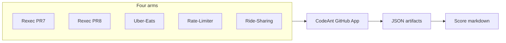
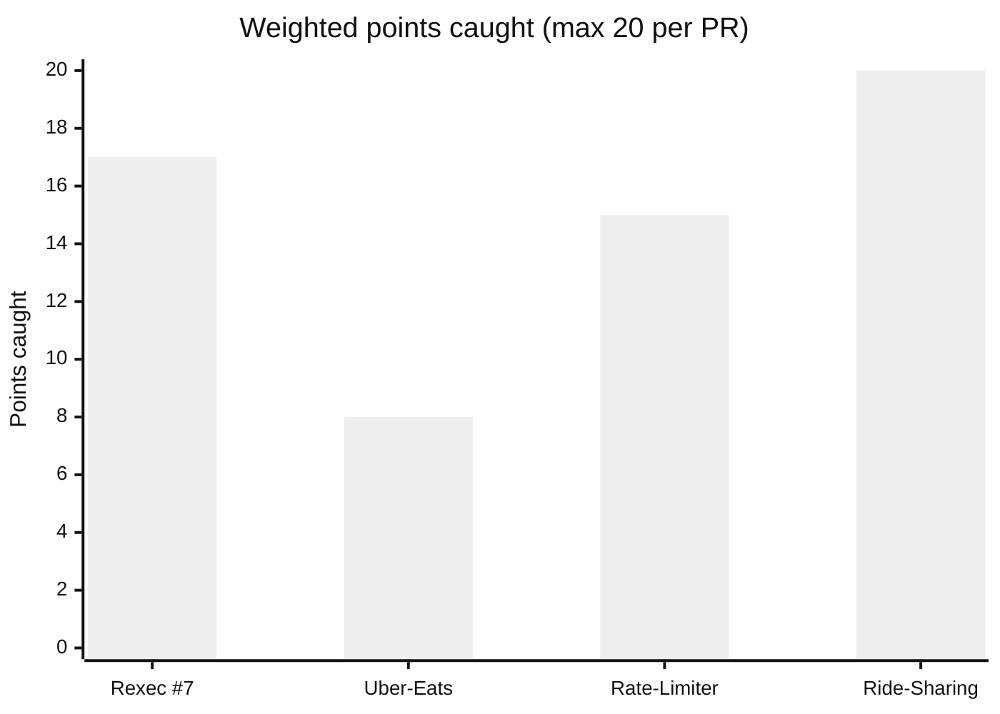
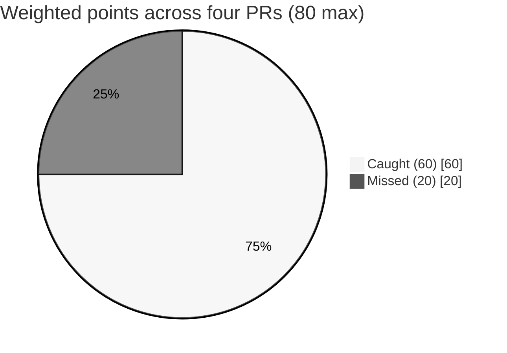
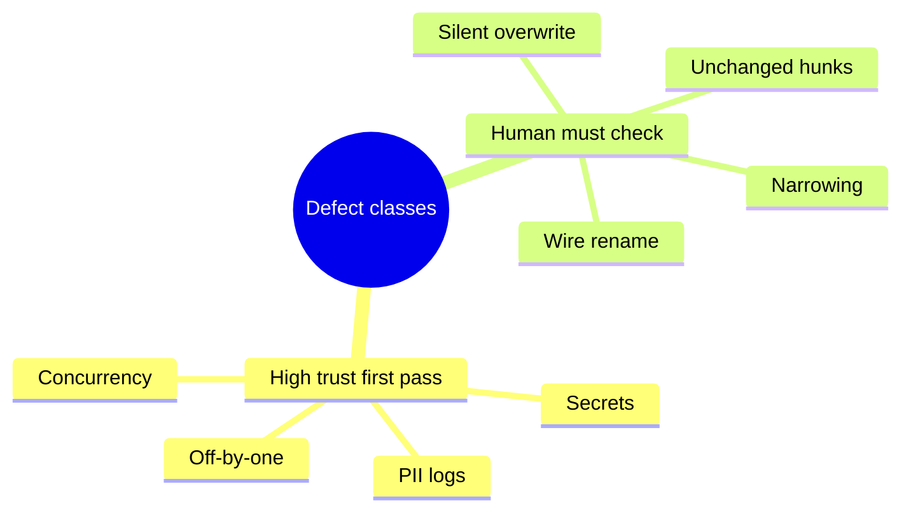

# CodeAnt benchmark — Confluence export pack

Use this file as the **source body** for a Confluence page (paste as Markdown where your Confluence supports it, or copy sections into the rich editor). **Primary evidence** remains in GitHub: [vickky06/codeant-benchmark](https://github.com/vickky06/codeant-benchmark) (`main`).

**Companion docs:** `NETAPP_RECOMMENDATION.md` · `docs/BENCHMARK-SUMMARY.md` · `docs/CALCULATION-VERIFICATION.md` · `docs/PRESENTATION-PREP.md` · `docs/CODEANT-VS-CLAUDE-AGENT.md`

---

## Page metadata (paste into Confluence description or labels)

| Field | Value |
|-------|--------|
| **Title** | CodeAnt AI — controlled benchmark (Rust + Go) |
| **Audience** | Engineering leadership, security, platform |
| **Status** | Decision support — snapshot 2026-05 |
| **Owner** | *(assign)* |
| **Confidentiality** | Internal — contains no NetApp source |

---

## 1. Executive summary (half page)

> **Recommendation:** Adopt CodeAnt in **advisory mode only**. Do **not** use it as a **manual gate** (“human only after CodeAnt approves”) or as a **branch-protection blocker** until a machine-readable pass signal exists and Round‑2 behavior is acceptable.

**Headline metrics (four seeded PRs, 20 weighted points each, 80 total):**

| Metric | Value |
|--------|--------|
| **Overall weighted recall** | **75%** — **60 / 80** points caught across Rexec #7, Uber‑Eats #1, Rate‑Limiter #1, Ride‑Sharing #1 |
| **Round 1 inline false positives** (as scored) | **0** on the graded threads |
| **Languages / surfaces** | **Rust** (telemetry, audit, proto) + **Go** (domain + HTTP middleware + concurrency) |
| **Highest-risk product finding** | **Ride‑Sharing Round 2:** **3 / 3** new inline threads on the **post‑fix** commit were **false positives** (stale line numbers vs `go test -race` clean). **No auto‑resolve** of fixed Round‑1 threads. |
| **Summary layer** | Auto PR‑body summaries **✅‑endorsed** defects that inline flagged as **Critical** on **all four** PRs — summary must **not** be an approval signal. |

**Merge gating:** Exported GitHub **`pulls/{n}/reviews`** show CodeAnt as **`COMMENTED`** with empty `body` only — **no `APPROVED` / `CHANGES_REQUESTED`** from that surface. Confirm **Checks** separately if you need branch protection. (`docs/CALCULATION-VERIFICATION.md`)

---

## 2. Benchmark methodology (short)

1. **Four PRs**, each with **hand‑seeded defects** and a **weighted answer key** (20 points / PR).  
2. **Two languages**, **four repos**, different surfaces (see results table).  
3. **Scoring:** weighted recall = (sum of weights for **CAUGHT** defects) / 20 × 100 per PR.  
4. **Artifacts:** GitHub REST JSON committed to the benchmark repo (`fetch_rexec_pr.sh`, `fetch_pr.sh`).  
5. **Fix loop + Round 2** where available; independent tool checks (`go test -race`, `cargo` toolchain) on fix heads as documented in score files.

---

## 3. Results at a glance (centerpiece table)

| PR | Language | Surface | Weighted recall | FP (Round 1 inline) | Summary quality (1–5) | Typical latency |
|----|----------|---------|-----------------|----------------------|------------------------|-----------------|
| [Rexec #7](https://github.com/vickky06/Rexec/pull/7) | Rust | Telemetry, audit, proto | **85%** (17/20) | 0 | 1 | ~9.2 min cold |
| [Rexec #8](https://github.com/vickky06/Rexec/pull/8) | Rust | Max code length (clean) | N/A | 0 | 4 | ~4.2 min warm |
| [Uber‑Eats #1](https://github.com/vickky06/Uber-Eats/pull/1) | Go | Domain model, state machine | **40%** (8/20) | 0 | 1 | ~6 min cold |
| [Rate‑Limiter #1](https://github.com/vickky06/Rate-Limiter/pull/1) | Go | HTTP middleware, admin | **75%** (15/20) | 0 | 1 | ~4.6 min warm |
| [Ride‑Sharing #1](https://github.com/vickky06/Ride-Sharing-Trip-Manager/pull/1) | Go | Concurrency | **100%** (20/20) R1; **3 FP** R2 on fix | 0 R1 | 1 | ~4.3 min cold; ~5.6 min incremental |

---

## 3b. Points caught vs missed (for native Confluence charts)

Use this **exact table** with Confluence **Insert → Chart** (or **Smart table / chart**): select the numeric columns → **Bar** → prefer **100% stacked bar** so each bar sums to 20.

| PR | Caught pts | Missed pts | Max |
|----|------------|------------|-----|
| Rexec #7 | 17 | 3 | 20 |
| Uber‑Eats #1 | 8 | 12 | 20 |
| Rate‑Limiter #1 | 15 | 5 | 20 |
| Ride‑Sharing #1 | 20 | 0 | 20 |
| **Total** | **60** | **20** | **80** |

---

## 4. Defect‑class heatmap (trust model)

| Defect class | Recall (this corpus) | Trust for first pass |
|--------------|------------------------|----------------------|
| Concurrency (race, deadlock, leak, RLock+write) | **5 / 5** | **High** — mechanism‑level reasoning |
| Hardcoded secrets | **3 / 3** | **High** |
| PII / sensitive data in logs | **2 / 2** | **High** |
| Off‑by‑one / boundary | **1 / 1** | **High** (counter‑example style) |
| Action error swallow | **1 / 2** | **Mixed** (Rust caught, Go U5 missed) |
| Wire‑breaking renames / API headers | **0 / 1** | **Low** — RL3 missed |
| Silent map overwrite / dup‑key | **0 / 2** | **Low** — **D4 + U4** cross‑language |
| Integer narrowing / contract | **0 / 1** | **Low** — U3 missed |
| Defects in **unchanged** hunks | **0 / 1** | **Low** — hunk‑focused review |

---

## 5. Three critical product limitations (gate killers)

1. **Summary regression** — PR‑body “CodeAnt‑AI Description” **✅**‑framed seeded defects even when inline flagged **Critical** (all four PRs; two modes in `NETAPP_RECOMMENDATION.md` §4).  
2. **Round 2 false positives + no resolve UX** — Ride‑Sharing: **100%** of new R2 threads on fix head were FP; Round‑1 threads stay “open” in the UI narrative (`RideSharing_PR_Score.md`).  
3. **No approved state** — Reviews **`COMMENTED`** only in JSON exports; branch protection cannot key off review object alone (`docs/CALCULATION-VERIFICATION.md`).

---

## 6. Bonus catches (value beyond seeds)

| Item | Where documented |
|------|------------------|
| `time.NewTicker` panic chain (admin update) | `RateLimiter_PR_Score.md` (unseeded) |
| `chargeOrder` / pre‑auth swallow | `UberEats_PR_Score.md` (unseeded) |
| Blocking `curl` in async cleanup | `PR1_CodeAnt_Score.md` (Rexec, unseeded) |
| Sequence diagram in Ride‑Sharing R2 | `RideSharing_PR_Score.md` (product artifact) |

---

## 7. Fix loop & developer experience

| PR | Wall‑clock proxy (R1 finish → fix pushed, per thread) |
|----|------------------------------------------------------|
| Uber‑Eats | 6 m 51 s |
| Rate‑Limiter | 5 m 20 s |
| Ride‑Sharing | 4 m 50 s |
| **Median** | **5 m 20 s / thread** |

**Caveat:** Go fixes were drafted with **Claude assistance**, not CodeAnt’s **Fix in Cursor** product surface — see `fix_loop_results_go_addendum.md`. Median is still **above** a **5‑minute** adoption pain threshold from the internal runbook (`docs/Go-Fix-Loop-Runbook.md` / `PRESENTATION-PREP.md`).

---

## 8. Operational rules (pilot) — pointer

Full **eight rules** live in **`NETAPP_RECOMMENDATION.md` §8**. Minimum set to repeat in Confluence:

- Do **not** treat PR‑body CodeAnt summary as any approval signal.  
- Humans must still check: **dup‑key / silent overwrite**, **renamed constants/headers**, **narrowed numeric types**, **unchanged hunks**.  
- Do **not** block merges on “CodeAnt clean” until **Checks** (or equivalent) are validated.  
- Round‑2 policy: allow marking **verified — false positive** without political friction.

---

## 9. Open gaps & next steps

| Gap | Why it matters |
|-----|----------------|
| **Java** | Not in corpus — NetApp web tier unknown. |
| **NetApp‑scale repos** | Sample repos ~5k LOC class — extrapolation unproven. |
| **Fix‑in‑Cursor UX** | Not measured on vendor button path. |
| **Enterprise tier / quota** | R2 did not fire on two Go PRs — suspected 403; confirm with vendor. |
| **Bitbucket parity** | Production target not exercised here. |

---

## 10. Mermaid diagrams (Confluence: add **Mermaid** macro, paste each block)

Confluence Cloud: type `/mermaid` → paste the fenced block **without** the outer markdown fence if your macro expects raw Mermaid only.

### 10a. Corpus flow

### 10b. Points caught per PR (simple bar — Confluence chart preferred for stacked)

### 10c. Aggregate pie — 60 caught vs 20 missed (80 total)

### 10d. Trust grouping (workshop — mindmap)

> **Note:** This is a **discussion aid**, not a computed chart. For evidence, use **§4**.

---

## 11. How to add “smart charts” in Confluence (native)

1. Insert the **§3b** markdown table into the page (or recreate as Confluence table).  
2. Select the table → **Insert** → **Chart** (or **Visuals** → chart, depending on edition).  
3. Choose **Bar** → **100% stacked** with series **Caught** + **Missed** (first column = category).  
4. Duplicate for **§3** recall % if you want a second chart (simple column chart on **Weighted recall** column).  
5. For timelines, use a **Roadmap** macro or a **Gantt** only if you have real dates; this benchmark is a point‑in‑time snapshot.

---

## 12. Optional child pages

| Child page | Source file |
|------------|-------------|
| Full recommendation + rules | `NETAPP_RECOMMENDATION.md` |
| Meeting script | `docs/PRESENTATION-PREP.md` |
| Arithmetic audit | `docs/CALCULATION-VERIFICATION.md` |
| Claude vs CodeAnt (qualitative) | `docs/CODEANT-VS-CLAUDE-AGENT.md` |
| Go corpus rationale | `docs/Go-Corpus-Design.md` |

---

## 13. Version

Generated for repo **vickky06/codeant-benchmark** `main`. When scores change, update **§3**, **§3b**, Mermaid **10b/10c**, and the **60/80** line in **§1**.
